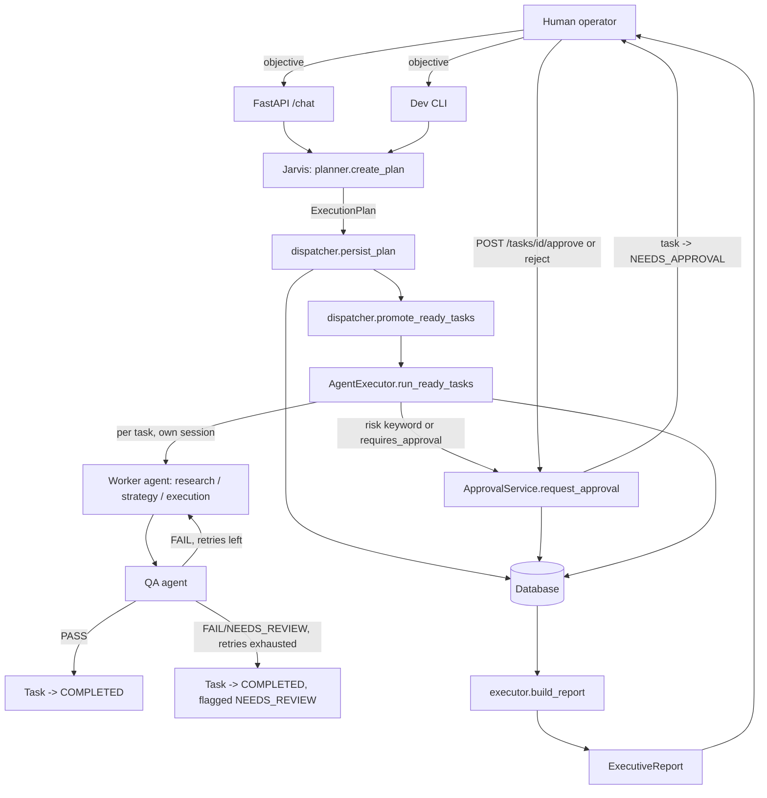
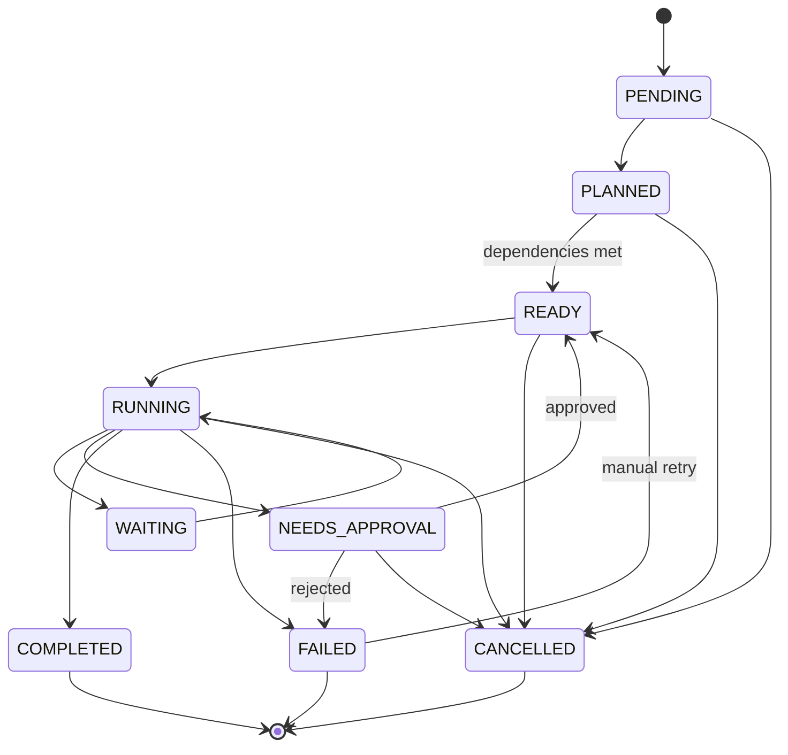
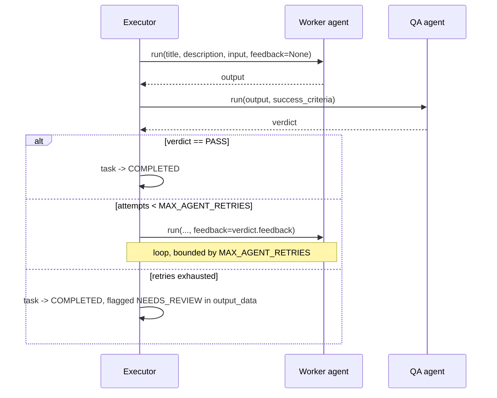
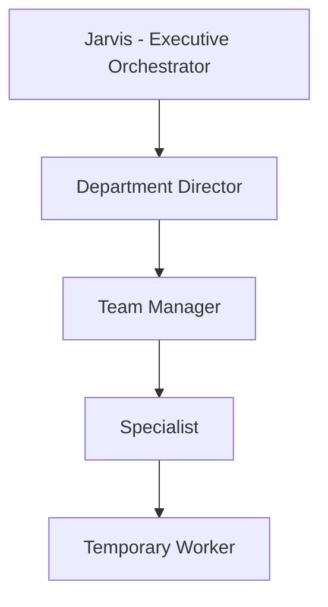

# Jarvis OS v0.1 — Architecture

Jarvis OS is a modular monolith. One FastAPI process hosts the orchestrator, the
specialist agents, the database access layer, and the CLI entry point. There is
no message bus, no microservice boundary, and no distributed worker pool in
v0.1 — see [Future Architecture](#future-architecture) for how this is intended
to scale without a rewrite.

## Request-to-report flow

## Component map

| Layer | Module | Responsibility |
|---|---|---|
| API | `app/api/routes.py` | Thin HTTP controllers; no business logic |
| CLI | `app/main.py` | Interactive terminal client, same orchestration calls as the API |
| Orchestration | `app/orchestration/planner.py` | Turns an objective into a validated `ExecutionPlan` (Pydantic, never free text) |
| Orchestration | `app/orchestration/dispatcher.py` | Persists a plan as `Task` rows; promotes tasks whose dependencies are met |
| Orchestration | `app/orchestration/executor.py` | Runs READY tasks (concurrently, bounded), gates on permissions/approval, drives the QA loop, builds the executive report |
| Orchestration | `app/orchestration/evaluator.py` | The bounded worker→QA retry loop |
| Orchestration | `app/orchestration/state_machine.py` | The only place task status transitions are validated |
| Agents | `app/agents/*.py` | Jarvis, Research, Strategy, Execution, QA — each a thin wrapper around a `ModelProvider` call with a strict system prompt and Pydantic output schema |
| Agents | `app/agents/registry.py` | Catalog of agent type → capabilities/permissions/model/factory |
| Agents | `app/agents/providers.py` | `ModelProvider` abstraction: `MockProvider` (deterministic, offline) and `OpenAIProvider` (live) |
| Tools | `app/tools/*.py` | Permission-checked functions (task/memory/approval/research) — the seam for future LLM function-calling. `url_safety.py` is the vendor-agnostic SSRF/size/timeout guard for any future live fetch. |
| Memory | `app/memory/manager.py`, `retrieval.py` | Working memory (per-run, in-process) and long-term memory promotion/retrieval |
| Security | `app/security/*.py` | Permission checks, approval-risk heuristics, audit event constants, deterministic evidence-QA checks (`evidence_qa.py`) |
| Database | `app/database/*.py` | SQLAlchemy models, async engine/session, repositories (the only place raw queries live) |
| Services | `app/services/*.py` | Transactional business logic (task lifecycle, projects, memory, approvals, evidence, usage) used by both the API and the orchestration layer |
| Usage/Budget | `app/agents/usage.py`, `app/config/pricing.py`, `app/orchestration/budget.py` | Model-usage side channel, configurable pricing (USAGE kept separate from ESTIMATED_COST), and mission budget checks |
| Research Intelligence | `app/research_intelligence/*.py` | Deterministic requirement planning, source-role classification, claim/source suitability, evidence relevance scoring, coverage matrix, and the candidate completeness gate — see [research_intelligence.md](research_intelligence.md) |
| Research model DTOs | `app/schemas/research_dto.py` | Small, mode-specific model-facing schemas (Discovery/Validation/General) kept separate from the rich internal `ResearchOutput` domain contract — see [research_dto.md](research_dto.md) |
| Decision & Action Intelligence | `app/decision_intelligence/*.py` | Domain contracts (Decision/ActionPlan/Action/ApprovalRequest/ExecutionResult/VerificationResult) and their deterministic lifecycle state machines, dependency/readiness validation, and canonical action hashing — contracts only, no engine yet. See [decision_intelligence.md](decision_intelligence.md) |

## Why per-task database sessions

`AsyncSession` is not safe to share across concurrently-running coroutines.
Independent tasks (e.g. three research tasks with no dependency on each other)
run concurrently via `asyncio.gather`, bounded by `MAX_CONCURRENT_AGENTS`. Each
concurrent task opens its **own** session from a shared `session_factory` and
commits independently. The sequential planning/dispatch/report phases share one
session for simplicity, with `session.expire_all()` called after any concurrent
execution phase so subsequent reads see what those other transactions
committed. See `app/orchestration/executor.py` for the full reasoning in-line.

## Task lifecycle

All transitions are enforced in `app/orchestration/state_machine.py`; no agent
or route mutates `Task.status` directly — everything routes through
`TaskService.transition`, which also writes the corresponding audit event.

## QA loop

The loop never marks a task `FAILED` just because QA disagrees — `FAILED` is
reserved for genuine execution errors (exceptions, permission denials, unknown
agent types). A QA verdict that never reaches PASS is *escalated*
(surfaced in the executive report's Open Questions), not hidden and not
endlessly retried.

## Future hierarchy

v0.1 ships five agents (Jarvis + four specialists) in one flat registry. The
registry (`app/agents/registry.py`) and task model already support a deeper
hierarchy without a rewrite:

Adding a department (Marketing, Sales, Finance, …) means:

1. Register new `AgentDescriptor`s (capabilities, permissions, model) in
   `build_default_registry`.
2. Implement the agent class (same shape as `ResearchAgent`/`StrategyAgent`).
3. Optionally add a `parent_task_id` chain so a director's task fans out into
   manager/specialist sub-tasks — the `tasks.parent_task_id` column already
   supports this.

No change to `dispatcher.py`, `executor.py`, or the state machine is required.

## Memory model

- **Working memory** (`app/memory/manager.py::WorkingMemory`) is a plain
  in-process dataclass scoped to a single orchestration run. It is never
  persisted as-is.
- **Long-term memory** (`memories` table) is only written when something is
  *explicitly promoted* — `MemoryManager.promote_research` /
  `promote_decision` / `promote_lesson`. Raw task output is not archived
  wholesale.
- **Retrieval** (`app/memory/retrieval.py::retrieve_relevant`) does keyword +
  type + importance filtering today. A vector store would slot in behind the
  same function signature later without touching callers.

## Research, evidence, usage, and budget (v0.1.1)

`app/tools/research_tools.py::ResearchProvider` is a `Protocol` with
`search()` / `fetch()` / `extract()`. `DevResearchProvider` (default) always
raises `ResearchUnavailableError` rather than fabricating results — exact v0.1
behavior. `MockResearchProvider` adds deterministic, offline, clearly-labeled
placeholder results so the full evidence pipeline can be exercised without a
live vendor. `RESEARCH_PROVIDER=live` is reserved until a web-search vendor is
selected. The Research Agent builds `EvidenceItem`s directly from real
provider results (never from model output), a deterministic evidence-QA layer
validates them before a task can pass, usage/cost are tracked per call via a
`contextvars` side channel, and budget guardrails stop a mission cleanly if
configured limits are hit. Full detail: [docs/evidence.md](evidence.md).
